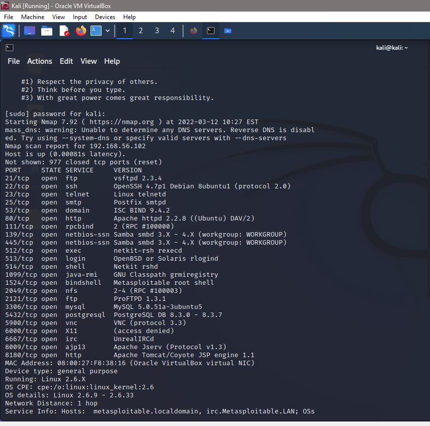

# Metasploit Framework
## Introduction

Pen-testing, often known as ethical hacking, is a short form of Penetration Testing. It is a technique for identifying security vulnerabilities in a computer system, network, or web application that a hacker could attack. The process entails gathering data on the target, prior to the check, defining probable entry sites, attempting to interrupt, and reporting back the results.                                                                                                   
In the penetration testing process, systems can be penetrated using penetration testing methodologies to detect vulnerabilities in systems, networks, hardware, and software. One of the most useful tools used in pen-testing as well as in hacking is the Metasploit framework (scanning to extracting). 
A Metasploit framework is a sophisticated tool that cybercriminals and ethical hackers can use to investigate systemic vulnerabilities on networks and servers. It can be easily customized and used with most operating systems because it is an open-source framework. In other words, the Metasploit Framework is a collection of commonly used tools that provides a complete environment for penetration testing and exploit development.

## History of Metasploit
 
Prior to Metasploit, pen-testers had to do all probes manually, developing their own code and manually introducing it onto networks, using a range of tools that may or may not have supported the platform they were testing. Remote testing was nearly unheard of, limiting a security expert's reach to the local area and firms that spent a lot of money on in-house IT and security specialists.
H D Moore, a network security professional, founded the Metasploit Project in the summer of 2003 with the purpose of creating a public resource for exploit code research and development. The code was originally built in Perl for a portable network tool, but by the end of 2007, it had all been rewritten in RUBY. Rapid7, a firm that provides vulnerability management solutions as well as a targeted remote exploit, fuzzing, anti-forensic, and evasion tools, has owned the project since 2009. The Metasploit framework, which is incorporated into the Kali Linux OS, houses some of these other tools. Metasploit takes advantage of modules that show the exploitability, risk, and remediation of that particular bug.

## Who Uses Metasploit

Metasploit is utilized by everyone from development, security and operation pros to hackers because of its vast range of uses and open-source availability. It's handy for everyone who needs a straightforward, dependable solution that works across platforms and languages. Cybercrime and cyber-attacks are very widespread these days. Hackers are constantly on the lookout for methods to disrupt a network or engage in other illegal actions. They attack and retrieve sensitive information once they find a loophole in a network or server, causing a problem for the organization, government, or country. The Metasploit framework is used to address these difficulties. The Metasploit framework can quickly detect a network's or server's weak spots. Following the identification, it is simple to document, and once documented, the organization or government can act on the weak places and remedy them before an attack occurs. This is an extremely important framework for businesses, organizations, and governments to save critical data.

## Reasons to use Metasploit

Metasploit is one of the most powerful penetration testing tools that is used to create and execute more advanced attacks. Pen-testers and anyone who works as a security analyst benefit from this tool for discovering hidden vulnerabilities and flaws within their information security programs.
There are specific factors that make Metasploit a must-have tool or framework to be chosen over traditional manual penetrating techniques:

#### 1.  open-source
One of the most important reasons for using Metasploit by pen-testers is it is a tool that allows the users to openly access its sources as they evolve going forward and even customize their own modules. 
#### 2. Capable of testing large networks 
Metasploit is a great tool for penetration testing from a time-saving point of view. In the case of large network penetration testing with manual exploitation, we need to apply exploits on each system of a large network one after the other. Metasploit on the other hand makes things a lot easier. Instead of testing systems one by one, Metasploit has the capability of testing the entire range of systems of a network automatically to exploit the vulnerabilities. 
#### 3. The easy payload switching mechanism
Metasploit offers easy and quick access to switch between payloads. This specific feature of Metasploit leads to the easier change of the meterpreter or adding a user and having remote access. Also,  Metasploit provides a modular combination with payloads.

## The Metasploit Framework
  
The framework consists of tools, libraries, modules, and user interfaces. The framework's main feature is a module launcher, which allows users to configure exploit modules and launch them at a target system. If the exploit is successful, the payload is executed on the target, and the user is given a shell to interact with the payload if the exploit is successful. There are hundreds of exploits and payload options available. Metasploit Framework presently supports a variety of operating systems, including Linux, Mac OS X, Windows, Android, and a few more.
The following are the basic methods for exploiting a system with the Framework:

1. Choosing and configuring an exploit (there are approximately 900 different exploits for Windows, Unix/Linux, and Mac OS X platforms)
2. Checking whether the intended target system is vulnerable to the chosen exploit is an option.
3. Choosing and customizing a payload (if entered successfully, the code will be run on the target system such as a remote shell)
4. Choosing the encoding strategy so that the encoded payload is ignored by the intrusion-prevention system (IPS)
5. Executing an exploit

## The Metasploit architecture
Metasploit architecture is composed of many important components including tools, libraries, modules, and user interfaces. To fully use the power of Metasploit, many components are required. In the following section different components of Metasploit architecture is presented. 

### Tools:
This is a set of useful command-line utilities
### Plugins: 
These are loadable extensions at runtime
### Libraries: 
A variety of MSF libraries allow us to run our exploits without having to create additional code for basic activities. The three libraries for metasploit are as follows:

* **REX:**
The basic library for most tasks
Handles sockets, protocols, text transformations, and others
SSL, SMB, HTTP, XOR, Base64, Unicode

* **MSF CORE:**
Provides the ‘basic’ API
Defines the Metasploit Framework

* **MSF BASE:**
Provides the ‘friendly’ API
Provides simplified APIs for use in the Framework
### Interfaces:   
These give users the ability to access Metasploit in different ways. Metasploit interfaces include Console, CLI ,GUI and web.
### Modules: 
A module is the framework's core feature. The framework is divided into five modules. 

* **Exploit Module:** 
Exploit modules are prepackaged pieces of code within the database that allow attackers or penetration testers to exploit a vulnerability on a local or remote system.  There are two types of exploits in Metasploit framework :
  * Active Metasploit: Exploit a specific host, run until completion, and then exit.

  * Passive Metasploit: Wait for incoming hosts and exploit them as they 
connect. Passive exploits are mostly used with clients such as FTP clients and web browsers.

* **Auxiliary Modules:**
Unlike exploit modules, auxiliary modules do not require the use of a payload to run. Auxiliary modules allow the framework to be extended for purposes other than exploitation. Auxiliary modules can use the protocol-specific application programme interfaces (APIs) for the Distributed Computing Environment Remote Procedure [DCERPC], HTTP, Server Message Block (SMB), and Sun Remote Procedure Call (RPC) protocols, as well as any Exploit module mixin.

* **Payloads:** Payload contains the set of instructions that will be executed by the victim's machine once it has been compromised. It allows the attacker to control the victim’s machine. A payload can be as simple as a few lines of code or small applications such as the Meterpreter Shell. 
* **Encoders:** It is used to convert code or information.
* **Nops:** Nops keep the payload sizes consistent across exploit attempts.
 

## Exploit Demonstration using Virtual Box

In this section we present few ways to attack a remote target. The main purpose of the VMware Workstation is to install Kali linux and Metasploitable 2 as virtual machines. With Kali Linux in Virtual Box, we present several attackes on Metasploitable operating system. Here, We have used MSFconsole for attacking the target machine.

**Metasploitable** is essentially a penetration testing lab in a box, available as a VMware virtual machine (VMX) based on Linux that contains several intentional vulnerabilities for you to exploit. With Metasploit, we can use ready-made or custom code and introduce it into a network to probe for weak spots. 
With the Metasploit framework installed in a system, an authorized penetration tester can utilize the Metasploit framework's tools to exploit vulnerabilities in a remote system.

First we need to identify the open Network Services on virtual machine using the Nmap Security Scanner. 

### Exploiting Apache_Tomcat
In this part, we try to attack the Apache Tomcat Web server in order to gain administrative’s credentials to gain access to the remote system. 
First step is to  open metasploit framework and to search for specific modules about the Apache Tomcat by using the command search Tomcat.

The Metasploit framework has a amodule  that can be used to launch a payload on Apache Tomcat servers called 
Tomcat manager uploads which address issues about authenticated code execution. We can use that to get a Meterpreter session. Based on what has been said, for explotation we used " exploit/multi/http/tomcat_mgr_upload "

The credentials is set to defalt which is tomcat, the port is set to  8180 instead of port 80 because this is the port that the Apache Tomcat is running. RHOST is set to 192.168.56.102 which is the IP address of remote hoset. Then we run the exploit. The exploit is uploading the payload and then it tries to execute JSP application. 

The exploit works and now we have a shell on the remote target.

### Exploiting FTP Server

FTP is a file transfer protocol that is often used by Webmasters to access files remotely. 
The first thing that we need to is to identify which systems are running the FTP service. We run a scan with Nmap to find open ports. 

As it can be seen that a FTP server is running on port 21. 
VSFTPD stands for very secure FTP daemon. It’s a stable, lightweight and secure FTP server for UNIX-like systems.
Then we run 

